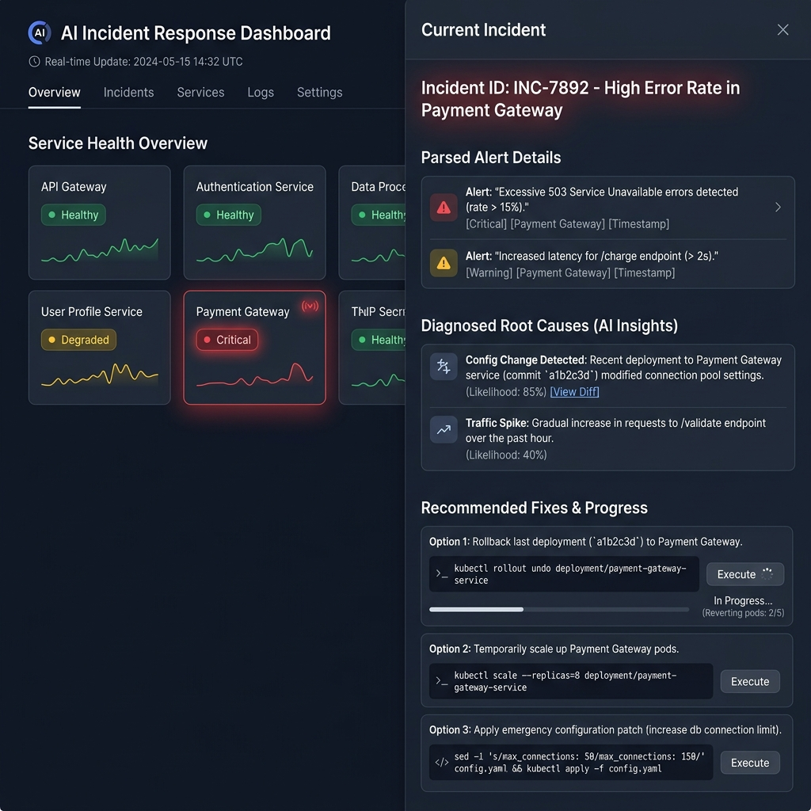

# AI_buganalyseManager (AI Incident Response Manager)

AI_buganalyseManager is an agentic, multi-stage incident response automation pipeline built on top of the Google Agent Development Kit (ADK) and FastAPI. It orchestrates a team of specialized AI agents working sequentially and in parallel to parse raw production logs, diagnose root causes against a known runbook database, recommend remediation commands, draft communications, and merge everything into a unified incident report.
**Predict. Prevent. Fix. Protect.**  
> An AI-powered SRE system that proactively detects failures, predicts incidents, recommends fixes, and performs safe auto-remediation before users are impacted.




---

## 🏆 Project Overview

**AI Incident Response Manager** is a multi-agent reliability platform designed to help engineering teams move from **reactive incident handling** to **proactive incident prevention**.

Instead of waiting for systems to fail, this tool continuously analyzes:

- Logs
- Metrics
- Traces
- Deployments
- Alerts
- SLO / SLI signals
- Service dependencies

It uses AI agents to detect early warning signs, predict possible incidents, identify root causes, suggest fixes, and safely execute low-risk auto-healing actions.

---

## ✨ One-Line Pitch

> **Your AI SRE team that predicts, prevents, and fixes incidents automatically.**

---

## 🧠 Why This Project?

Modern production systems are complex. During incidents, engineers need to quickly:

- Understand alerts
- Analyze logs
- Check recent deployments
- Identify root cause
- Suggest mitigation
- Communicate updates
- Prevent recurrence

This project automates that workflow using a **multi-agent AI system**.

---

## 🚀 Unique Features

### 🧠 Proactive Failure Prediction Engine

- Continuously monitors logs, metrics, deployments, traces, and SLO signals
- Detects anomalies before they become incidents
- Predicts possible service failures before customer impact
- Provides confidence score and estimated time-to-impact

---

### ⚡ Auto-Fix Before Incident

- Suggests fixes before a production outage happens
- Automatically applies safe remediations
- Supports multiple execution modes:
 ## System Architecture


```text
SAFE       → Auto-execute
MEDIUM     → Human approval required
HIGH RISK  → Suggest only


## Workflow Step-by-Step

1. **Ingestion**: Raw unstructured service logs are sent to the FastAPI backend.
2. **Alert Analysis**: The `alert_analyzer` agent standardizes the log, identifies the logging level, extracts the timestamp, and labels the service and error signature.
3. **Root Cause Diagnostics**: The `root_cause_agent` executes fuzzy matches against the local runbook database, checking incident context (such as VirtualService mesh changes or DB pool capacity settings) to classify the root cause.
4. **Parallel Fix & Comms Generation**:
   * The `fix_recommender` fetches corresponding remediation steps and maps risk levels, estimated duration, and CLI hints (such as `kubectl scale` or `gcloud deploy`).
   * The `comms_agent` drafts internal Slack alerts and customer-facing status page updates, auto-publishing the Slack alert.
5. **Unified Reporting**: The orchestrator invokes `merge_report.py` to compile the metadata, root cause analysis, fix tasks, and draft messages into a single report schema.

---

## Local Setup & Execution

### Prerequisites
* Python 3.10+
* Active Google AI Studio API Key (set as `GOOGLE_API_KEY` in environment)

### Installation
1. Clone the repository.
2. Create and activate a Python virtual environment:
   ```bash
   python -m venv venv
   source venv/bin/activate  # On Windows: venv\Scripts\activate
   ```
3. Install dependencies:
   ```bash
   pip install -r requirements.txt
   ```
4. Copy the environment template and insert your API key:
   ```bash
   cp .env.example .env
   ```

### Running the App
Start the FastAPI server:
```bash
python -m uvicorn api.main:app --host 127.0.0.1 --port 8000
```
Open [http://localhost:8000/](http://localhost:8000/) in your browser to view the interactive dashboard.
